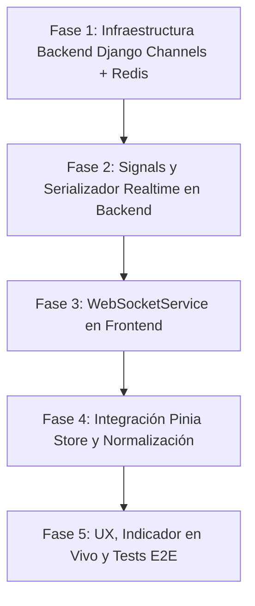

# Transacciones en Tiempo Real (WebSockets)

**Diseño:** 17 de Agosto de 2026 · **Implementado:** 18 de Agosto de 2026  
**Proyecto:** `com_brasper_backofice` (Frontend Vue 3) + `com_brasper_api` (Backend **FastAPI**)  
**Alcance:** Sincronización en vivo de creación, edición y eliminación de transacciones en la tabla del Backoffice.

> **Estado: implementado.** Este documento nació como plan y describía un backend
> Django con Channels + Redis. El API real es **FastAPI**, así que la
> implementación difiere del plan original en dos puntos, ambos registrados en la
> sección 8:
>
> - El transporte es el WebSocket nativo de FastAPI/Starlette, no Django Channels.
> - El fan-out entre procesos usa `LISTEN`/`NOTIFY` de Postgres en vez de Redis,
>   para no añadir infraestructura.
>
> Las secciones 2 y 3 se conservan como registro de la evaluación previa; lo
> vigente es la sección 8.

---

## 1. Resumen Ejecutivo y Objetivo

El objetivo es permitir que la tabla de transacciones de Brasper se actualice de forma **instantánea y automática** cuando cualquier operador, cliente o proceso del sistema:

1. **Crea** una nueva transacción.
2. **Edita** una transacción (cambio de estado, montos, cotización, cuentas bancarias, asignación de tags, subida de comprobantes).
3. **Elimina** o anula una transacción.

Actualmente, los operadores deben recargar la página o cambiar filtros manualmente para ver cambios realizados por otros usuarios o por el sistema. La solución implementará un canal de comunicación en tiempo real entre el **Backend (Django)** y el **Frontend (Vue 3 + Pinia)**.

---

## 2. Comparativa Técnica de Arquitectura

Para este caso de uso analizamos las 3 opciones principales:


| Criterio                      | Opción A: WebSockets (Django Channels + Redis)                                                   | Opción B: Server-Sent Events (SSE)                                                                | Opción C: Servicio Externo (Centrifugo / Pusher)                              |
| ----------------------------- | ------------------------------------------------------------------------------------------------ | ------------------------------------------------------------------------------------------------- | ----------------------------------------------------------------------------- |
| **Direccionalidad**           | Bidireccional (Full Duplex).                                                                     | Unidireccional (Servidor → Cliente).                                                              | Bidireccional o Unidireccional gestionado.                                    |
| **Complejidad Backend**       | Media/Alta (requiere ASGI, `daphne`/`uvicorn`, Redis Channel Layer).                             | Baja/Media (HTTP/2 nativo con `StreamingHttpResponse` o ASGI ligero).                             | Baja en Django (HTTP webhook/API push), pero añade dependencia externa.       |
| **Reconexión & Heartbeat**    | Manual o con librería cliente (`reconnecting-websocket`).                                        | Nativa en el navegador (`EventSource` reconecta automáticamente).                                 | Gestionada por el SDK del proveedor.                                          |
| **Auth con JWT**              | Query param `?token=` en handshake inicial o ticket temporal.                                    | Query param o cabecera `Authorization` (usando polyfill como `fetch-event-source`).               | Token firmado por backend.                                                    |
| **Idoneidad para Backoffice** | **Recomendada** si a futuro se agregarán chats, presencia de operadores o bloqueos concurrentes. | **Recomendada** si el requerimiento es puramente recibir actualizaciones de eventos del servidor. | Alternativa si no se desea mantener infraestructura Redis/ASGI en producción. |


> **Recomendación Arquitectónica:**  
>
> - **Backend:** **Django Channels** con **Redis Channel Layer** (o SSE si la infraestructura actual de Django es estrictamente WSGI sincrónica y no se quiere desplegar ASGI aún).  
> - **Frontend:** Cliente WebSocket tipado con auto-reconexión, heartbeat y despacho de acciones hacia el store Pinia (`useTransactionsStore`).

---

## 3. Arquitectura del Backend (Django)

### 3.1. Infraestructura y Capas

1. **Protocolo:** `wss://` (producción) / `ws://` (local).
2. **Ruta WebSocket:** `/ws/transactions/`
3. **Capa de Transporte:** ASGI (`asgi.py`) con Django Channels y Redis (`channels_redis`).
4. **Grupo de difusión (Channel Group):** `transactions_updates` (o particionado por empresa/rol: `transactions_tenant_{id}`).

### 3.2. Autenticación en WebSocket

Debido a que el API de WebSocket del navegador no permite enviar headers `Authorization` personalizados en el handshake HTTP inicial:

- **Enfoque de Token:** Se envía el JWT en query parameter: `wss://api.brasper.com/ws/transactions/?token=<ACCESS_TOKEN>` o mediante un ticket de un solo uso solicitado previamente vía REST `POST /api/auth/ws-ticket/`.
- **Middleware Django Channels (`JWTAuthMiddleware`):**
  - Extrae y valida el JWT con `django-rest-framework-simplejwt` o PyJWT.
  - Asigna `scope['user']` al usuario autenticado.
  - Rechaza la conexión con código `4001 (Unauthorized)` si el token expiró o el usuario carece de permisos (`transactions.view`).

### 3.3. Disparo de Eventos (Django Signals / Services)

Los eventos se emiten en los hooks del ciclo de vida del modelo o servicio:

- `**post_save` en `Transaction`:**
  - Si `created == True` → Evento `TRANSACTION_CREATED`.
  - Si `created == False` → Evento `TRANSACTION_UPDATED`.
- `**post_delete` en `Transaction`:**
  - Evento `TRANSACTION_DELETED`.
- **Subida de comprobantes / tags / destinos:**
  - Evento `TRANSACTION_UPDATED`.

```python
# Ejemplo conceptual en Django (signals.py o services.py)
from asgiref.sync import async_to_sync
from channels.layers import get_channel_layer
from .serializers import TransactionRealtimeSerializer

def broadcast_transaction_event(event_type: str, transaction_instance):
    channel_layer = get_channel_layer()
    payload = TransactionRealtimeSerializer(transaction_instance).data
    
    async_to_sync(channel_layer.group_send)(
        "transactions_updates",
        {
            "type": "transaction_message",
            "data": {
                "event": event_type,  # 'CREATED' | 'UPDATED' | 'DELETED'
                "transaction": payload,
                "timestamp": timezone.now().isoformat(),
                "actor": {
                    "id": str(getattr(transaction_instance, '_updated_by_id', None)),
                    "username": getattr(transaction_instance, '_updated_by_name', None)
                }
            }
        }
    )
```

### 3.4. Formato del Payload del Evento

```json
{
  "event": "TRANSACTION_CREATED",
  "timestamp": "2026-08-17T15:45:00Z",
  "actor": {
    "id": "usr_9812",
    "name": "Operador Juan"
  },
  "data": {
    "id": "tx_123456",
    "transaction_code": "TRS-2026-08-17-001",
    "status": "pending",
    "client": { "id": "cli_55", "full_name": "Carlos Gomez" },
    "origin_amount": 1000.0,
    "origin_currency": "BRL",
    "destination_amount": 185.0,
    "destination_currency": "USD",
    "exchange_rate": 5.4054,
    "send_date": "2026-08-17T10:00:00Z",
    "created_at": "2026-08-17T15:45:00Z",
    "updated_at": "2026-08-17T15:45:00Z",
    "destinations": [
      { "id": "dst_1", "bank_name": "BCP", "account_number": "191-xxx", "amount": 185.0 }
    ],
    "vouchers": [],
    "tags": []
  }
}
```

---

## 4. Arquitectura del Frontend (`com_brasper_backofice`)

### 4.1. Estructura de Capas (Clean Architecture)

```
src/
├── interface/
│   ├── infrastructure/
│   │   └── services/
│   │       ├── websocket_service.ts       # Cliente genérico de WebSocket (reconexión, heartbeat)
│   │       └── domain.ts                  # Helper para wsBaseUrl (ws:// o wss:// según SSL)
│   └── config/
│       └── env.ts                         # VITE_WS_BASE_URL (opcional, fallback a apiBaseUrl)
└── modules/
    └── transacciones/
        ├── infrastructure/
        │   └── realtime/
        │       └── transactions_realtime_client.ts  # Suscriptor de eventos de transacciones
        ├── presentation/
        │   ├── controllers/
        │   │   └── use_transactions_store_controller.ts  # Handlers de mutación en memoria
        │   └── composables/
        │       └── use_transactions_realtime.ts     # Hook para ciclo de vida de la vista
```

### 4.2. Cliente de Conexión WebSocket (`WebSocketService`)

Características fundamentales de resiliencia:

1. **Reconexión Automática con Backoff Exponencial:** Si el servidor se reinicia o hay microcortes de red, reintenta a 1s, 2s, 4s, 8s hasta 30s.
2. **Heartbeat (Ping/Pong):** Envío de un `{ type: "ping" }` cada 30 segundos para evitar que proxies o Nginx cierren conexiones inactivas.
3. **Resincronización tras Reconexión:** Si la conexión se pierde y vuelve, se dispara una recarga en segundo plano (`loadTransactions(..., { background: true })`) para garantizar que no se perdieron eventos mientras estuvo desconectado.
4. **Autenticación con Token:** Toma el JWT actual desde `authStore.token`. Si el token se refresca, actualiza la sesión del socket.

### 4.3. Estrategia de Mutación en el Store (`useTransactionsStore`)

El manejo en memoria debe ser inteligente para no romper la experiencia del usuario con filtros o paginación activa:

#### A. Evento `TRANSACTION_CREATED`:

- **¿Cumple los filtros activos?** (Ejemplo: filtro por fecha o por estado).
  - Si el usuario está en la **Página 1** y no hay filtros excluyentes: Se inserta al inicio de `transactions` con animación de destaque (highlight).
  - Si el usuario está en la **Página 2+** o hay filtros que la excluyen: Solo se incrementa `total += 1` y se muestra un aviso flotante / badge: *"1 nueva transacción recibida (Clic para ver)"*.
- **Secuencia diaria (`dailySequenceById`):** Se llama a `resetDailySequences()` para recalcular los correlativos del día.

#### B. Evento `TRANSACTION_UPDATED`:

- Se busca la transacción en `transactions` por su `id`.
- Si está presente en la página visible:
  - Se aplica `enrichTransactionWithSpecialDiscountMeta(payload)`.
  - Se reemplaza la fila existente manteniendo su posición.
  - Se activa un efecto visual sutil (parpadeo verde/azul en la fila) para indicar que fue editada.
- Si cambiaron montos o fechas que alteran el correlativo, se llama a `resetDailySequences()`.

#### C. Evento `TRANSACTION_DELETED`:

- Se filtra la lista: `transactions = transactions.filter(t => t.id !== id)`.
- Se decrementa el contador: `total = Math.max(0, total - 1)`.
- Se invalida la secuencia diaria.

### 4.4. UI y Experiencia de Usuario (UX)

1. **Indicador de Estado en Vivo:** Un pequeño punto en la cabecera de la tabla:
  - 🟢 *En vivo* (Conectado)
  - 🟡 *Reconectando...*
  - 🔴 *Desconectado (Modo manual)*
2. **Toast / Notificación Discreta:** Cuando otro operador crea una transacción mientras alguien tiene un modal de detalle abierto.
3. **Bloqueo / Alerta de Edición Concurrente:** Si el Operador A tiene abierto el formulario de edición de una transacción y el Operador B la modifica en ese mismo instante, se le muestra una advertencia: *"Esta transacción fue modificada recientemente por otro usuario"*.

---

## 5. Plan de Implementación Paso a Paso




### Fase 1: Backend — Configuración ASGI & Channels

- Instalar `channels` y `channels-redis` en `com_brasper_api`.
- Configurar `ASGI_APPLICATION = "config.asgi.application"` y `CHANNEL_LAYERS`.
- Implementar `JWTAuthMiddleware` para autenticar tokens en la URL WebSocket.
- Crear el consumidor `TransactionsConsumer` suscrito al grupo `transactions_updates`.

### Fase 2: Backend — Emisión de Eventos

- Crear `TransactionRealtimeSerializer` con payload ligero y estructurado.
- Conectar `post_save` y `post_delete` en `com_brasper_api` para publicar eventos al canal Redis.
- Pruebas unitarias de emisión de mensajes en Django.

### Fase 3: Frontend — Infraestructura de Conexión

- Configurar en `src/interface/config/env.ts` la derivación de `wsBaseUrl` (usando `ws://` o `wss://`).
- Implementar `src/interface/infrastructure/services/websocket_service.ts` con tipado estricto, heartbeat y backoff exponencial.
- Añadir manejo de autenticación en la conexión con el JWT de `useAuthStore`.

### Fase 4: Frontend — Integración con Store de Transacciones

- Crear el composable `src/modules/transacciones/presentation/composables/use_transactions_realtime.ts`.
- Extender `useTransactionsStore` con acciones `onRealtimeCreated`, `onRealtimeUpdated`, `onRealtimeDeleted`.
- Integrar el hook en `transacciones_view.vue` en `onMounted` y `onBeforeUnmount` (o `onActivated` / `onDeactivated`).
- Gestión inteligente de paginación y recálculo de `dailySequenceById`.

### Fase 5: UI, Polish y Testing

- Indicador de estado de conexión WebSocket en la vista de transacciones.
- Resaltado visual temporal (CSS highlight) en filas modificadas en tiempo real.
- Banner de "Nuevas transacciones disponibles" si el usuario está en páginas posteriores.
- Pruebas unitarias en Vitest para las mutaciones del store.
- Pruebas de integración E2E (Playwright) simulando eventos WebSocket y validando renderizado.
- Validación local estricta con `npm run check`.

---

## 6. Consideraciones de Rendimiento y Escalabilidad

1. **Throttling y Debounce en Ráfagas:** Si se importan 500 transacciones masivas por Excel, no se deben emitir 500 mensajes WebSocket individuales. El backend debe emitir un único evento `TRANSACTIONS_BULK_IMPORTED` indicando al front que recargue la página.
2. **Carga de Red:** El payload en tiempo real debe incluir únicamente los datos esenciales de la transacción (evitando binarios de comprobantes o datos pesados innecesarios).
3. **Seguridad y Permisos:** Si un usuario no tiene permiso `transactions.view`, el backend rechaza la conexión al socket. Si un usuario solo tiene acceso a sus propias transacciones, los canales se aíslan por `user_id`.

---

## 7. Conclusión y Siguientes Pasos

Este diseño proporciona una solución robusta, escalable y tolerante a fallos, manteniendo la **Clean Architecture** del frontend y desacoplando la capa de transporte del modelo de dominio. 

Para comenzar con la implementación, se recomienda iniciar con el checklist de la **Fase 1 y 2 en el backend**, seguido por la **Fase 3 y 4 en el frontend**.

---

## 8. Implementación final (18 de Agosto de 2026)

### 8.1. Backend (`com_brasper_api`, FastAPI)

**Canal:** `/ws/transactions` (y `/ws/transactions/`), declarado en `app/main.py`.
Es el **único** endpoint WebSocket: el duplicado que existía bajo
`/transactions/ws` se eliminó para no mantener dos rutas de autenticación que
pudieran divergir. Toda la lógica vive en
`app/modules/transactions/adapters/router/transactions_websocket.py`.

**Handshake y alcance de lectura (`authenticate_websocket`).** El token llega en
`?token=` porque el navegador no permite cabeceras en el handshake. No basta con
validar la firma: el JWT sólo lleva `sub` y `sid`, así que se carga el usuario,
se resuelve su rol y se consulta `RolePermissionModel` — la misma consulta que
usa `require_permission` en el REST. El resultado es `(user_id, can_view_all)`,
donde `can_view_all` es cierto sólo si el rol tiene `transactions.view`.

Esto replica exactamente el alcance del listado REST (`_scope_transaction_user`):

| Suscriptor | Recibe |
|---|---|
| Rol con `transactions.view` | Todos los eventos |
| Rol sin `transactions.view` | Sólo eventos cuyo `user_id` sea el suyo |
| Token ausente, inválido o usuario irresoluble | Nada: cierre con `1008` |

El filtrado es **fail-closed**: si un evento no identifica a su dueño, los
suscriptores restringidos no lo reciben. Preferimos perder una actualización
antes que filtrar datos de otro cliente. Por eso `TRANSACTION_DELETED` incluye
el `user_id` de la transacción borrada (tomado de `previous`) y no sólo el id.

**Fan-out entre procesos.** El broadcast es en dos capas:

1. `manager.dispatch_local()` reparte a las conexiones de *este* proceso.
2. `pg_notify` en el canal `brasper_transactions_events` replica el evento al
   resto de workers y réplicas.

El emisor reparte en local **antes** de publicar, y cada mensaje lleva un
`origin` con el id del proceso para que su propio `NOTIFY` no se reparta dos
veces. Así, si el canal de Postgres se cae, el tiempo real se degrada sólo entre
procesos y nunca en el proceso que atendió la petición. `TransactionEventListener`
mantiene el `LISTEN` con `asyncpg` y reconecta con backoff exponencial hasta 30 s;
arranca y para en el `lifespan` de la app.

**Límite de 8 KB de `NOTIFY`.** Una transacción con muchos destinos o vouchers no
cabe. `_build_notify_payload` detecta el exceso (umbral de 6500 bytes) y replica
un sobre reducido con `partial: true` y sólo `{id, user_id}`. El frontend lo
resuelve recargando la fila desde el REST. El reparto local siempre lleva el
payload completo, así que el recorte sólo afecta a los otros procesos.

### 8.2. Frontend (`com_brasper_backofice`)

Sin cambios respecto a las secciones 4.2–4.4, más el manejo de `partial`:
`TransactionsRealtimeClient` deriva esos eventos a `onPartial`, y el composable
recarga en segundo plano manteniendo el highlight de la fila. Un borrado
recortado no necesita recarga: el id basta.

### 8.3. Cobertura

- Backend: `tests/test_transactions_websocket.py` — 16 tests (handshake, alcance
  por permisos, fail-closed, recorte de `NOTIFY`, eco del listener). Suite
  completa: 239 tests.
- Frontend: 319 tests, 45 archivos. `vue-tsc --noEmit` limpio.

### 8.4. Operación

- **Variable opcional:** `VITE_WS_BASE_URL` en el backoffice. Vacía, la URL del
  socket se deriva de la base HTTP del API (`wss://` en remoto, `ws://` en local).
- **No requiere infraestructura nueva.** No hay Redis: el fan-out usa el Postgres
  que ya está desplegado. Tampoco hay que fijar el número de workers — la
  implementación es correcta con uno o con varios.
### 8.5. Configuración del proxy (aplicada el 18/08/2026)

`apibras.finzeler.com` se sirve con Nginx 1.24 desde
`/etc/nginx/sites-enabled/com_brasper_api`. El `location /` original tenía
`proxy_http_version 1.1` pero **no** reenviaba el upgrade, así que el handshake
llegaba al API como HTTP plano y el middleware de auth lo cortaba con 401. Se
añadió un `location /ws/` dedicado:

```nginx
location /ws/ {
    proxy_pass http://127.0.0.1:8590;
    proxy_http_version 1.1;

    proxy_set_header Upgrade $http_upgrade;
    proxy_set_header Connection "upgrade";

    proxy_set_header Host $host;
    proxy_set_header X-Real-IP $remote_addr;
    proxy_set_header X-Forwarded-For $proxy_add_x_forwarded_for;
    proxy_set_header X-Forwarded-Proto $scheme;

    proxy_connect_timeout 60s;
    proxy_send_timeout 3600s;
    proxy_read_timeout 3600s;

    proxy_buffering off;
}
```

Notas de esa configuración:

- `Connection` se fija literal en vez de derivarlo de un `map $http_upgrade`.
  El `map` iría en el bloque `http` de `nginx.conf`, compartido por los otros
  siete sitios del servidor; el `location` sólo afecta a este dominio. Bajo
  `/ws/` no hay ninguna ruta HTTP que pueda romperse por recibir la cabecera.
- `proxy_read_timeout` a 1 h. Los 60 s del `location /` alcanzan para un
  heartbeat de 30 s, pero sin margen, y cada corte espurio dispara una
  reconexión con su recarga de tabla.
- No hay CDN delante: `apibras.finzeler.com` resuelve directo al servidor.
- `TokenAuthMiddleware` es `BaseHTTPMiddleware`, que sólo actúa sobre scope
  `http`, así que no intercepta el handshake.

**Verificación del handshake.** Sin el `location`, la respuesta era
`401 Unauthorized` (del middleware HTTP). Con él, es `403 Forbidden`, que es lo
que devuelve Starlette al cerrar un WebSocket antes del `accept()`. Cuando el
API despliegue este código, un token válido debe dar
`101 Switching Protocols`.

> **Pendiente de despliegue.** Al 18/08/2026 el contenedor `com_brasper_api` en
> producción corre una imagen anterior a este trabajo y no expone la ruta
> `/ws/transactions`, así que el `403` observado es «ruta inexistente», no un
> rechazo de credenciales. El `101` queda por confirmar tras el despliegue,
> junto con la prueba de fan-out entre dos workers.
