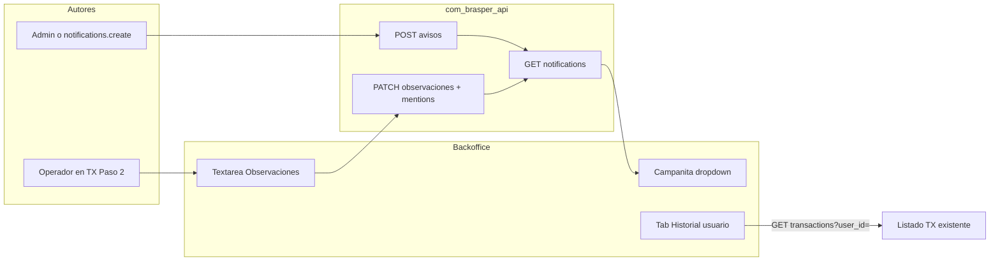

# Plan — Notificaciones in-app, Observaciones @, Historial y permisos por usuario

**Fecha:** 2026-09-07  
**Estado:** Diseño validado (pendiente de implementación)  
**Alcance:** `com_brasper_backofice` + `com_brasper_api`  
**Objetivo:** bandeja de avisos en la campanita, observaciones con menciones `@Nombre` a roles internos, historial de transacciones en Usuarios, y permisos configurables también por usuario.

## Alcance cerrado

- Solo backoffice.
- Campanita = bandeja única de avisos internos + menciones desde observaciones.
- Calendario y chat del topbar: fuera de este MVP (stubs; el chat apunta mal a `/app/cupones`). Se ocultan o deshabilitan.
- Avatar ya funciona (`/app/perfil`); no se toca.
- Permisos por rol (`/app/roles-permisos`) se mantienen **y** se podrán personalizar por usuario.

## Situación actual

| Pieza                 | Estado                                                                                    |
| --------------------- | ----------------------------------------------------------------------------------------- |
| Iconos topbar         | Solo en `src/interface/layout/app_layout.vue`; badges hardcodeados; campanita sin handler |
| Módulo notificaciones | No existe en FE ni API                                                                    |
| Observaciones en TX   | Dominio FE parsea `observaciones` defensivamente; no se envía ni existe columna en API    |
| @menciones            | No existe                                                                                 |
| Historial en Usuarios | Tabs solo Datos + Cuentas; API ya tiene `GET /transactions?user_id=`                      |
| Permisos              | Solo matriz por rol; `_load_permissions` ignora usuario                                   |

## Arquitectura objetivo

---

## Fase 1 — API: notificaciones + observaciones

**Repo:** `com_brasper_api`

### 1.1 Modelo de notificaciones

Tabla `notifications`:

- `id`, `recipient_user_id`, `actor_user_id` (nullable para avisos sistema)
- `type`: `aviso` | `mention`
- `title`, `body`
- `entity_type` / `entity_id` (ej. `transaction` + UUID) para deep-link
- `read_at`, `created_at`

Endpoints:

- `GET /notifications` — inbox del usuario autenticado (`unread_count` + página)
- `POST /notifications/{id}/read` y `POST /notifications/read-all`
- `POST /notifications/avisos` — crear aviso; requiere `notifications.create`

Permisos nuevos (espejo FE `permissions.ts` y API `permissions.py`):

- `notifications.view` — ver propia bandeja
- `notifications.create` — publicar avisos internos

### 1.2 Observaciones en transacciones

- Columna `observaciones` (`Text`, nullable) en `transaction`
- Create/update/read schemas
- Payload: texto libre + `mentioned_user_ids: UUID[]`
- Validación: solo roles internos (`admin`, `sales`, `accounting`, `marketing`, …). Rechazar `client` → 400
- Por cada mención válida: notificación `type=mention` con link a la TX
- Un usuario = un rol (sin multi-rol). Las menciones filtran por rol interno, no por módulos

### Regla de mención visible: `@Nombre`

- En el texto se inserta y muestra `@Ana Pérez` (display name), no UUID ni email
- `mentioned_user_ids` es solo el payload técnico para notificar

---

## Fase 2 — FE: campanita y avisos

**Repo:** `com_brasper_backofice`

- Módulo `src/modules/notifications/`
- En `app_layout.vue`: badge real, dropdown, “Nuevo aviso” si `notifications.create`
- Polling ~60s o al enfocar ventana (sin WebSocket en MVP)
- Ocultar calendario y chat
- Sin `notifications.view` no se muestra la campanita

---

## Fase 3 — FE: Observaciones con @ en Paso 2

**Archivo:** `transacciones_view.vue` (`createStepIndex === 1`)

- Textarea Observaciones
- `MentionTextarea`: al escribir `@`, autocomplete de staff interno; inserta `@Nombre`
- Nunca clientes
- Payload: `observaciones` + `mentioned_user_ids`
- Preview/detalle muestra `@Nombre`

---

## Fase 4 — FE: Historial en Usuarios

**Archivos:** `use_user_workspace.ts`, `UserWorkspacePanel.vue`, `usuarios_view.vue`

- Tab `historial` además de `profile` | `accounts`
- Contador `total` + lista paginada vía `getTransactions({ user_id })`
- Columnas: fecha, código, montos, estado
- Permiso: `users` + `transactions.view`
- Sin API nueva

---

## Fase 5 — Permisos y acceso por usuario

Hoy el acceso sale solo del rol. Objetivo: personalizar por usuario sin romper la matriz por rol.

### Resolución (API)

En `_load_permissions`:

1. Si `users.permissions` (JSONB) no es null → esas son las efectivas
2. Si es null → hereda matriz del rol
3. Admin en FE sigue bypasseando en UI

### API

- Columna `users.permissions` JSONB nullable (`null` = heredar)
- Create/update aceptan `permissions: string[] | null`
- Login/`/me` devuelven permisos efectivos + `permissions_customized: boolean`
- Quién edita: `users.update` + `roles.permissions.update`
- No aplica a rol `client`

### FE

- En Usuarios, sección/tab **Acceso** (staff interno)
- Toggle: Heredar del rol vs Personalizar
- Grilla reutilizando catálogo de `roles_permissions_view.vue`
- Tras guardar el propio usuario, refrescar `/auth/me`

### Ejemplo

Rol `sales` sin blog → Ana (sales) Personalizar → `blog.`* → solo Ana entra al blog.

Las @menciones siguen filtrando por rol interno, no por estos permisos.

---

## Orden de implementación

1. API notificaciones + permisos de módulo + migración observaciones
2. API + FE permisos por usuario (Fase 5)
3. Campanita FE + crear aviso
4. Observaciones + @ → menciones
5. Tab Historial usuarios

**Gate:** `npm run check` (backoffice) + tests/migración API.

## Fuera de alcance

- WhatsApp / Telegram / email
- Calendario y chat del topbar
- WebSocket realtime para badges
- Métricas agregadas por estado por usuario
- Multi-rol por usuario
- Overrides de permisos para `client`

## Checklist de implementación

- API: tabla `notifications` + endpoints inbox/read/avisos
- API: permisos `notifications.view` / `notifications.create`
- API: columna `observaciones` + `mentioned_user_ids` en TX
- API: `users.permissions` JSONB + `_load_permissions` con override
- FE: módulo notifications + campanita real
- FE: `MentionTextarea` con `@Nombre` (solo roles internos)
- FE: tab Historial en Usuarios
- FE: tab/sección Acceso por usuario

