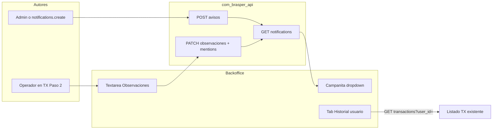

# Plan — Notificaciones in-app, Observaciones @, Historial y permisos por usuario

**Fecha:** 2026-09-07  
**Estado:** Implementado y validado localmente el 2026-09-11; despliegue pendiente.
**Alcance:** `com_brasper_backofice` + `com_brasper_api`  
**Objetivo:** bandeja de avisos en la campanita, observaciones con menciones `@Nombre` a roles internos, historial de transacciones en Usuarios, y permisos configurables también por usuario.

## Alcance cerrado

- Solo backoffice.
- Campanita = bandeja única de avisos internos + menciones desde observaciones.
- Calendario y chat del topbar: fuera de este MVP (stubs; el chat apunta mal a `/app/cupones`). Se ocultan o deshabilitan.
- Avatar ya funciona (`/app/perfil`); no se toca.
- Permisos por rol (`/app/roles-permisos`) se mantienen **y** se podrán personalizar por usuario mediante deltas (añadir/quitar) sobre el rol.

## Situación actual


| Pieza                 | Estado                                                                                    |
| --------------------- | ----------------------------------------------------------------------------------------- |
| Iconos topbar         | Solo en `src/interface/layout/app_layout.vue`; badges hardcodeados; campanita sin handler |
| Módulo notificaciones | No existe en FE ni API                                                                    |
| Observaciones en TX   | Dominio FE parsea `observaciones` defensivamente; no se envía ni existe columna en API    |
| @menciones            | No existe                                                                                 |
| Historial en Usuarios | Tabs solo Datos + Cuentas; API ya tiene `GET /transactions?user_id=`                      |
| Permisos              | Solo matriz por rol; `_load_permissions` ignora usuario                                   |


## Arquitectura objetivo




---

## Fase 1 — API: notificaciones + observaciones

**Repo:** `com_brasper_api`

### 1.1 Modelo de notificaciones

Tabla `notifications`:

- `id`, `recipient_user_id`, `actor_user_id` (nullable para avisos sistema)
- `type`: `aviso` | `mention`
- `title`, `body`
- `entity_type` / `entity_id` (ej. `transaction` + UUID) para deep-link
- `read_at`, `created_at`

Endpoints:

- `GET /notifications` — inbox del usuario autenticado (`unread_count` + página)
- `POST /notifications/{id}/read` y `POST /notifications/read-all`
- `POST /notifications/avisos` — crear aviso; requiere `notifications.create`

Permisos nuevos (espejo FE `permissions.ts` y API `permissions.py`):

- `notifications.view` — ver propia bandeja
- `notifications.create` — publicar avisos internos

### 1.2 Observaciones en transacciones

- Columna `observaciones` (`Text`, nullable) en `transaction`
- Create/update/read schemas
- Payload: texto libre + `mentioned_user_ids: UUID[]`
- Validación: solo roles internos (`admin`, `sales`, `accounting`, `marketing`, …). Rechazar `client` → 400
- Por cada mención válida: notificación `type=mention` con link a la TX
- Un usuario = un rol (sin multi-rol). Las menciones filtran por rol interno, no por módulos

### Regla de mención visible: `@Nombre`

- En el texto se inserta y muestra `@Ana Pérez` (display name), no UUID ni email
- `mentioned_user_ids` es solo el payload técnico para notificar

---

## Fase 2 — FE: campanita y avisos

**Repo:** `com_brasper_backofice`

- Módulo `src/modules/notifications/`
- En `app_layout.vue`: badge real, dropdown, “Nuevo aviso” si `notifications.create`
- Polling ~60s o al enfocar ventana (sin WebSocket en MVP)
- Ocultar calendario y chat
- Sin `notifications.view` no se muestra la campanita

---

## Fase 3 — FE: Observaciones con @ en Paso 2

**Archivo:** `transacciones_view.vue` (`createStepIndex === 1`)

- Textarea Observaciones
- `MentionTextarea`: al escribir `@`, autocomplete de staff interno; inserta `@Nombre`
- Nunca clientes
- Payload: `observaciones` + `mentioned_user_ids`
- Preview/detalle muestra `@Nombre`

---

## Fase 4 — FE: Historial en Usuarios

**Archivos:** `use_user_workspace.ts`, `UserWorkspacePanel.vue`, `usuarios_view.vue`

- Tab `historial` además de `profile` | `accounts`
- Contador `total` + lista paginada vía `getTransactions({ user_id })`
- Columnas: fecha, código, montos, estado
- Permiso: `users` + `transactions.view`
- Sin API nueva

---

## Fase 5 — Permisos y acceso por usuario

Hoy el acceso sale solo del rol. Objetivo: personalizar por usuario sin romper la matriz por rol ni perder las mejoras futuras del rol.

### Modelo: rol + deltas por usuario (no reemplazo total)

Se descarta guardar una lista completa por usuario: dejaría de heredar cambios posteriores en la matriz del rol y obligaría a copiar el rol entero al personalizar. En su lugar, dos columnas en `users`:

- `permissions_granted` JSONB (default `[]`): permisos añadidos sobre el rol
- `permissions_revoked` JSONB (default `[]`): permisos quitados al rol

```
efectivos = (matriz_del_rol ∪ granted) − revoked ∪ garantizados_del_rol
```

- "Heredar del rol" = ambas listas vacías. `permissions_customized` se calcula (`granted` o `revoked` no vacíos), no se persiste.
- Admin no usa overrides: sigue con bypass total en API y FE.

### Permisos garantizados por rol (compartidos API ↔ FE)

El FE ya tiene el concepto en `withGuaranteedRolePermissions` (contabilidad conserva siempre `ACCOUNTING_PERMISSION_KEYS`). Se formaliza:

- API: `GUARANTEED_ROLE_PERMISSIONS` en `permissions.py`, idéntico a la lista del FE
- `_load_permissions` re-añade los garantizados al final, aunque estén en `revoked`
- Un `revoked` que incluya un garantizado responde 400 (la UI no debe mostrar un toggle que no hace nada)
- Test en cada repo que verifique que ambas listas coinciden (fixture compartida o snapshot)

### Resolución (API)

`_load_permissions` en `dependencies.py` es el **único** punto de resolución. Lo llaman login y `/me` (`main.py`), `get_current_permissions` y `authorize_user_creation`; ningún caller reimplementa la lógica.

1. Cargar usuario; si `role == admin` devolver todo
2. Base = `role_permission.permissions` o `default_permissions_for_role(role)`
3. Aplicar `∪ granted`, `− revoked`, `∪ garantizados`
4. Devolver lista ordenada y sin duplicados

Tests mínimos:

- `sales` con `granted=[blog.view]` → tiene `blog.view`
- `accounting` con `revoked=[accounting.view]` → sigue teniendo `accounting.view`
- `sales` con `revoked=[coupons.create]` → no tiene `coupons.create`
- Cambio en la matriz del rol se refleja en usuarios con overrides

### Reglas de negocio (API)

- Solo roles internos (`sales`, `accounting`, `marketing`, `user`) admiten overrides. `client` con overrides no vacíos → 400
- Editar overrides requiere `users.update` **y** `roles.permissions.update`
- Un usuario no puede editar sus propios overrides (evita auto-escalada) → 403
- Al cambiar el rol de un usuario se vacían ambos deltas: se calcularon contra otro rol
- Solo claves de `ALL_PERMISSIONS`; una clave desconocida → 400, no se filtra en silencio
- Create/update aceptan `permissions_granted?: string[]` y `permissions_revoked?: string[]`; una clave presente en ambas → 400

### Contrato de login y `/me`

Devolver `role`, `permissions` (efectivos, con garantizados incluidos), `permissions_granted`, `permissions_revoked`. El FE usa `permissions` para toda la UI; los deltas solo para pintar la pestaña Acceso. Las sesiones activas del usuario editado ven el cambio en su siguiente `/me` (opcional: aviso por el WebSocket existente).

### FE — eliminar el bypass por rol

Hoy `hasPermission` en `use_auth_store_controller.ts` consulta primero `roleGrantsPermission`, que concede todo el catálogo de contabilidad a cualquier `accounting` ignorando la lista real. Eso impide revocar. Cambios:

- `hasPermission`: `admin` → `true`; cualquier otro rol → solo `this.permissions.includes(...)`
- `roleGrantsPermission` deja de usarse en el store (puede quedar para tests o eliminarse)
- `normalizePermissions` (fallback a defaults del rol + garantizados) se usa **solo** para la matriz de roles (`roles/permissions`), nunca para la lista efectiva del usuario en login/`/me`
- Actualizar `permissions.test.ts` y tests del store

Este cambio se puede desplegar **antes** que el API: con la lista efectiva actual el comportamiento no varía para nadie.

### FE — pestaña Acceso en Usuarios

- Visible solo para staff interno y con `users.update` + `roles.permissions.update`
- Grilla reutilizando el catálogo de `roles_permissions_view.vue`, con tres estados por celda: **heredado** (del rol), **añadido**, **quitado**
- Celdas de permisos garantizados bloqueadas con tooltip
- Botón "Restablecer al rol" vacía ambos deltas
- Payload: `permissions_granted` / `permissions_revoked`
- Tras guardar el propio usuario (no aplica por la regla anti auto-escalada, pero por si un admin edita su sesión), refrescar `/auth/me`

### Ejemplo

Rol `sales` sin blog → Ana (sales) `granted=[blog.view, blog.create]` → solo Ana entra al blog. Si mañana `sales` gana `blog.view` en la matriz, Ana lo conserva sin tocar nada. Si a Ana se le pone `revoked=[coupons.create]`, deja de crear cupones aunque su rol pueda.

Las @menciones siguen filtrando por rol interno, no por estos permisos.

### Orden dentro de la fase

1. API: migración (dos columnas), `GUARANTEED_ROLE_PERMISSIONS`, `_load_permissions`, validaciones, tests
2. FE: quitar bypass en `hasPermission`, acotar `normalizePermissions`, tests
3. FE: pestaña Acceso

---

## Orden de implementación

1. API notificaciones + permisos de módulo + migración observaciones
2. API + FE permisos por usuario (Fase 5)
3. Campanita FE + crear aviso
4. Observaciones + @ → menciones
5. Tab Historial usuarios

**Gate:** `npm run check` (backoffice) + tests/migración API.

## Fuera de alcance

- WhatsApp / Telegram / email
- Calendario y chat del topbar
- WebSocket realtime para badges
- Métricas agregadas por estado por usuario
- Multi-rol por usuario
- Overrides de permisos para `client`

## Checklist de implementación

- [x] API: tabla `notifications` + endpoints inbox/read/avisos
- [x] API: permisos `notifications.view` / `notifications.create`
- [x] API: columna `observaciones` + `mentioned_user_ids` en TX
- [x] API: `users.permissions_granted` / `permissions_revoked` JSONB + `_load_permissions` con deltas y garantizados
- [x] API: `GUARANTEED_ROLE_PERMISSIONS` espejo de `ACCOUNTING_PERMISSION_KEYS` + snapshots de paridad
- [x] FE: `hasPermission` sin bypass por rol (solo admin); `normalizePermissions` acotado a matriz de roles
- [x] FE: módulo notifications + campanita real
- [x] FE: `MentionTextarea` con `@Nombre` (solo roles internos)
- [x] FE: tab Historial en Usuarios
- [x] FE: tab/sección Acceso por usuario

## Cierre y verificación local — 2026-09-11

- API: 300 pruebas aprobadas en suite aislada sin R2 real; permisos, destinatarios, lectura propia, JSON/multipart de observaciones y migraciones.
- Frontend: `pnpm run check` correcto (tipos, lint, 384 pruebas y rutas canónicas). Lint conserva 15 advertencias anteriores.
- Build de producción con Vite correcto; conserva advertencias por tamaño de bundles.
- Chromium: 3 pruebas con API simulada cubren bandeja, publicación/lectura, historial, guardado de acceso y campanita por permiso.
- Login normal y social resuelven permisos por el mismo servicio. Guardar solo acceso conserva los datos de perfil.
- Endpoints adicionales: `GET /notifications/staff`, limitado a usuarios internos activos y sin datos de contacto.
- Migraciones 079 y 080: columnas de permisos, observaciones, notificaciones y habilitación inicial de la bandeja para roles internos.

### Despliegue y límites de la validación

Las migraciones se comprobaron mediante sus operaciones upgrade/downgrade y compilación SQL PostgreSQL; no se ejecutaron contra una base PostgreSQL real. Las pruebas Chromium usan respuestas simuladas. Dos pruebas de integración R2 quedan excluidas porque requieren el servicio real.

Antes de publicar: aplicar `alembic upgrade head` en el entorno de despliegue con su configuración y respaldo habituales; desplegar la API y después el frontend. No se modificó producción desde esta tarea.

